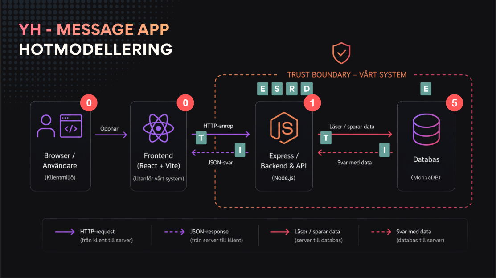
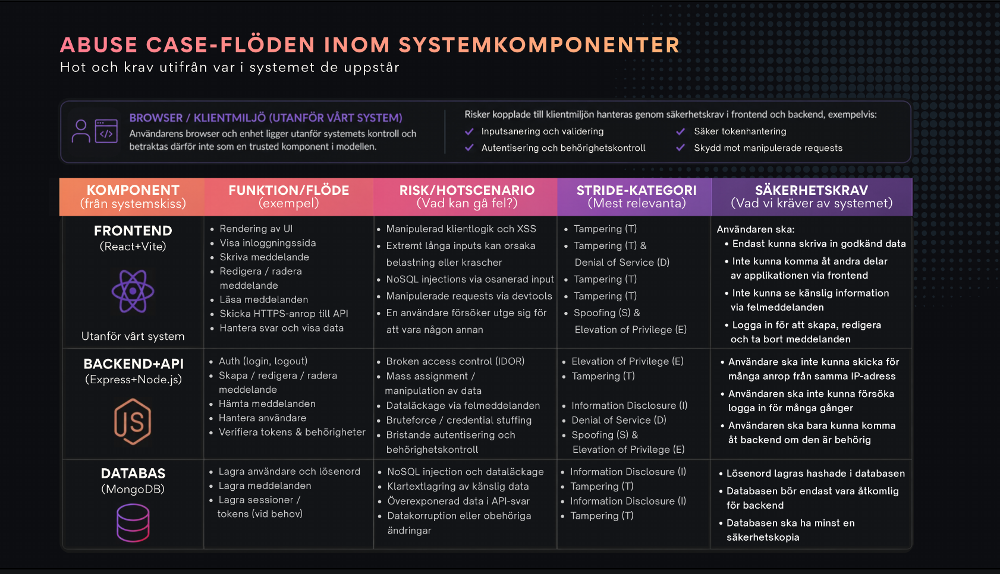
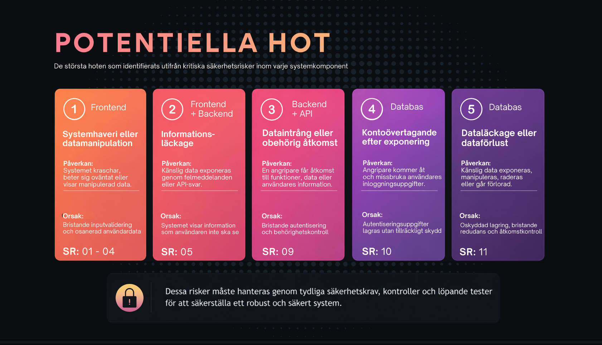

# Inlämning 1 - Planeringsfasen

Carolina Hindocha, Josefin Lindgren, Isabel González

## Systemskiss - Motivering

Vi har valt att behålla det förenklade dataflödesdiagrammet på global nivå, då applikationens arkitektur inte kräver en komplex design. Browser och frontend visas i skissen som klientdelen utanför tillitszonen, medan backend/API och databas ligger inom vårt system. Backend och API hålls ihop eftersom API-endpoints och routing är en del av Express-backendens logik, inte en separat gateway eller tjänst.

## Hotmodellering (STRIDE)

Vi har utgått från den förenklade Rapid Threat-modellen där komponenter först klassas utifrån om de tillhör vårt system och hur skyddsvärda de är:

- **Browser och frontend har värde 0 eftersom de ligger utanför vår tillitszon.** Större påverkan på systemet vid kompromettering/driftstörning eftersom backend hanterar logik, API-routing, behörighet och bearbetningen av lagrad data. Darför gav vi backenden ett initialt högt värde (3). Men eftersom den utgör ingångspunkten till tillitszonen, innebär det enligt modellen att backend/API får värde 1. Det betyder inte att den inte kräver striktare säkerhetsåtgärder, utan att den här aspekten inte fångas fullt ut av de förenklade reglerna i den här skissen.

- Utifrån mallen har vi främst kunnat placera **Tampering och Information Disclosure på dataflöden mellan komponenter med olika skyddsvärde**, samt identifierat den högsta risknivån vid **databasen, som fått värde 5**.

- Vi har placerat **Spoofing och Denial of Service enligt mallens zonregler**. Vid backend/API förekommer **ESRD**: Exempelvis skulle loginförsök eller överbelastning mot den här delen av systemet kunna vara realistiska hot.

- Vi har också diskuterat att både request- och responseflöden kan vara utsatta för manipulation. Därför kan **Tampering vara relevant både när data skickas in till systemet och när data returneras**, (särskilt om svaret påverkar vad användaren ser och gör), men detta fångades inte enligt modelleringens regler. Vi kompletterade därför med ett fördjupat säkerhetsresonemang kring abuse cases och hot mot systemets olika komponenter.

- Sammanfattningsvis har vi använt mallen som stöd för en första prioritering, men kompletterar med manuellt resonemang kring faktiska hot som modellen inte fångar perfekt. **Mallen hjälper oss prioritera, men den ersätter inte manuellt säkerhetsresonemang.**

## Abuse case-flöden kopplat till systemkomponeter

För att konkretisera hotmodelleringen bröts systemet ner i abuse cases kopplade till respektive systemkomponent. Fokus låg på de delar av applikationen som utvecklas och kan säkerhetskravställas (frontend, backend/API och databas) medan browsern och klientmiljön betraktades som delar utanför systemets tillitszon (trust boundary).
Tabellen visar hur funktioner, risker/hotscenarier, STRIDE-kategorier och säkerhetskrav hänger ihop genom systemets olika delar. Detta skapade sedan grunden för att identifiera och prioritera de mest kritiska säkerhetsriskerna och potentiella hoten mot systemet.

## Potentiella hot utifrån kritiska säkerhetsrisker

## Potentiella hot - Detaljerad beskrivning

### Frontend (React + Vite)

#### Hot: Systemhaveri eller datamanipulation (Denial of Service och Tampering)

- Påverkan:
  - Manipulerad eller osanerad användarinput kan orsaka systemfel och manipulation av data samt att systemet kraschar eller beter sig oväntat.
- Orsak:
  - Frontend validerar eller begränsar inte användarinput tillräckligt, vilket möjliggör manipulerade requests, XSS eller överbelastning via stora inmatningar.

### Frontend + Backend

#### Hot: Informationsläckage eller obehörig åtkomst (Information Disclosure och Spoofing)

- Påverkan:
  - Angripare kan få åtkomst till känslig information genom felmeddelanden eller API-svar och kan manipulera data eller kringgå autentisering och behörighetskontroller.
- Orsak:
  - Bristfällig validering, osanerad användarinput eller otillräckliga autentiserings- och auktoriseringskontroller mellan frontend och backend gör att systemet visar information som användaren inte ska se.

### Backend/API

#### Hot: Dataintrång eller obehörig åtkomst (Elevation of Privilege och Repudiation)

- Påverkan:
  - Manipulation av hur koden styrs från serversidan.
  - Lateral movement för att komma åt databasen.
  - Svårt att ta reda på vem som gjort det om inte loggar finns (repudiation).
- Orsak:
  - Bristfällig åtkomstkonfiguration (antal inloggningsförsök och API-anrop, JWT Token).
  - Ingen konfiguration för loggar.

### Databas (MongoDB)

#### Hot: Kontoövertagande efter exponering (Information Disclosure, Spoofing)

- **Påverkan:**
  Skanningar från antagonister kan hitta en exponerad databas och försöka logga in, får åtkomst till funktioner, data eller användares information.

- **Orsak:**
  Öppna portar som exponerar databasen mot offentliga nätverk.

#### Hot: Dataläckage eller dataförlust (Information Disclosure)

- **Påverkan:**
  Komprometterad data kanutnyttjas till ransomware-attacker med double-extorsion eller säljas på darkweb.

- **Orsak:**
  Default-inställningarna på MongoDB kräver inte autentisering från användarna.

## Säkerhetskrav

Varje säkerhetskrav har tilldelats ett unikt **SR-ID** (Security Requirement) för att skapa spårbarhet (traceability) genom hela utvecklingsprocessen. Metoden underlättar sammankopplingen av säkerhetskrav, identifierade hot, STRIDE-kategorier samt implementering och kodgranskning under projektets gång. Vi har också formulerat kraven som **User Stories** för att underlätta kommunikationen med utvecklarna, enligt best practice inom IT-branschen.

(Ytterligare säkerhetskrav som identifierats under arbetet har exkluderats från denna sammanfattning för att hålla fokus på de fem prioriterade säkerhetskraven.)

